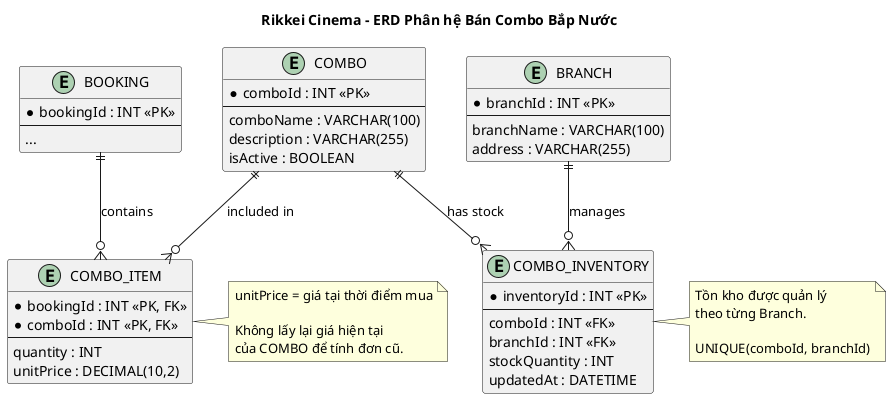

# [SÁNG TẠO] THIẾT KẾ MỞ RỘNG ERD PHÂN HỆ BÁN COMBO BẮP NƯỚC

## 1. Mục tiêu bài tập

Thiết kế ERD cho phân hệ bán Combo bắp nước của **Rikkei Cinema**.

`BOOKING` từ các bài trước được sử dụng làm Entity trung tâm và chỉ có `bookingId` là khóa chính.

Thiết kế tối đa **3 Entity mới**, không tính `BOOKING`, đồng thời phải giải quyết hai vấn đề:

1. Tồn kho phải được quản lý riêng theo từng cơ sở.
2. Giá Combo phải được lưu chính xác tại thời điểm khách mua.

---

# 2. Phân tích bài toán

Rikkei Cinema bán thêm các Combo bắp nước khi khách đặt vé.

Một `BOOKING` có thể:

- Không mua Combo nào.
- Mua một hoặc nhiều Combo.
- Một loại Combo có thể mua với số lượng tùy ý.

Danh mục Combo được dùng chung cho toàn chuỗi, nhưng tồn kho phải được quản lý riêng theo từng cơ sở.

Ví dụ:

```text
Combo A:
Cơ sở 1: 10 phần
Cơ sở 2: 0 phần
Cơ sở 3: 25 phần
```

Nếu cơ sở 2 hết hàng thì không được làm ảnh hưởng đến tồn kho của cơ sở 1 và cơ sở 3.

Ngoài ra, giá Combo có thể thay đổi theo thời gian.

Ví dụ:

```text
01/09: Combo Couple = 100.000
15/09: Combo Couple = 120.000
```

Nếu khách mua ngày 10/09 thì đơn hàng phải giữ giá **100.000**, không được lấy lại giá 120.000 sau khi giá thay đổi.

---

# 3. Thiết kế Entity

## 3.1. Entity COMBO

Entity `COMBO` lưu thông tin danh mục Combo dùng chung cho toàn chuỗi.

| Attribute | Data Type | Key | Description |
|---|---|---|---|
| `comboId` | INT | PK | Mã Combo |
| `comboName` | VARCHAR(100) | | Tên Combo |
| `description` | VARCHAR(255) | | Mô tả Combo |
| `isActive` | BOOLEAN | | Trạng thái đang bán |

### Lưu ý

Không lưu `stockQuantity` trong `COMBO`.

Không lưu giá bán hiện tại để dùng trực tiếp cho các đơn hàng cũ.

---

## 3.2. Entity COMBO_ITEM

`COMBO_ITEM` là Entity trung gian giữa `BOOKING` và `COMBO`.

Entity này lưu các Combo mà khách mua trong từng đơn hàng.

| Attribute | Data Type | Key | Description |
|---|---|---|---|
| `bookingId` | INT | PK, FK | Mã đơn đặt hàng |
| `comboId` | INT | PK, FK | Mã Combo |
| `quantity` | INT | | Số lượng Combo |
| `unitPrice` | DECIMAL(10,2) | | Giá 1 Combo tại thời điểm mua |

### Ý nghĩa quan trọng của `unitPrice`

`unitPrice` phải được ghi nhận ngay khi khách mua.

Ví dụ:

```text
Giá hiện tại của Combo = 120.000

Khách đã mua trước đó:
unitPrice = 100.000
quantity = 2

Tổng tiền Combo = 2 × 100.000 = 200.000
```

Sau này giá Combo tăng lên 120.000 thì đơn cũ vẫn sử dụng `unitPrice = 100.000`.

---

## 3.3. Entity COMBO_INVENTORY

Entity `COMBO_INVENTORY` dùng để quản lý tồn kho theo từng cơ sở.

| Attribute | Data Type | Key | Description |
|---|---|---|---|
| `inventoryId` | INT | PK | Mã tồn kho |
| `comboId` | INT | FK | Mã Combo |
| `branchId` | INT | FK | Mã cơ sở |
| `stockQuantity` | INT | | Số lượng tồn kho |
| `updatedAt` | DATETIME | | Thời điểm cập nhật |

Nên đặt ràng buộc:

```text
UNIQUE(comboId, branchId)
```

để một Combo chỉ có một bản ghi tồn kho tại một cơ sở.

---

# 4. Entity có sẵn: BOOKING và BRANCH

## 4.1. BOOKING

`BOOKING` là Entity có sẵn từ các bài trước.

| Attribute | Data Type | Key |
|---|---|---|
| `bookingId` | INT | PK |

Các thuộc tính khác của `BOOKING` không cần thiết cho phạm vi bài này nên được bỏ qua.

---

## 4.2. BRANCH

`BRANCH` là Entity cơ sở/rạp đã tồn tại trong hệ thống.

Entity này **không tính vào 3 Entity mới** của bài.

| Attribute | Data Type | Key |
|---|---|---|
| `branchId` | INT | PK |
| `branchName` | VARCHAR(100) | |
| `address` | VARCHAR(255) | |

---

# 5. Các mối quan hệ

## 5.1. BOOKING - COMBO_ITEM

Một `BOOKING` có thể không mua Combo hoặc mua nhiều Combo.

```text
BOOKING 1 ---- 0..N COMBO_ITEM
```

Cardinality:

```text
BOOKING ||--o{ COMBO_ITEM
```

---

## 5.2. COMBO - COMBO_ITEM

Một `COMBO` có thể xuất hiện trong nhiều `COMBO_ITEM` thuộc nhiều đơn hàng.

```text
COMBO 1 ---- 0..N COMBO_ITEM
```

Cardinality:

```text
COMBO ||--o{ COMBO_ITEM
```

---

## 5.3. COMBO - COMBO_INVENTORY

Một `COMBO` có thể có tồn kho tại nhiều cơ sở.

```text
COMBO 1 ---- 0..N COMBO_INVENTORY
```

Ví dụ:

```text
Combo Couple
    |
    +-- Cơ sở A: 20
    +-- Cơ sở B: 5
    +-- Cơ sở C: 0
```

---

## 5.4. BRANCH - COMBO_INVENTORY

Một `BRANCH` có thể quản lý tồn kho của nhiều Combo.

```text
BRANCH 1 ---- 0..N COMBO_INVENTORY
```

---

# 6. Tổng hợp ERD

```text
                    ┌──────────────┐
                    │   BOOKING    │
                    │--------------│
                    │ PK bookingId │
                    └──────┬───────┘
                           │
                         1 │
                           │
                         0..N
                    ┌──────▼───────┐
                    │  COMBO_ITEM  │
                    │--------------│
                    │ PK bookingId │
                    │ PK comboId   │
                    │ quantity     │
                    │ unitPrice    │
                    └──────┬───────┘
                           │
                         N │
                           │
                           │ 1
                    ┌──────▼───────┐
                    │    COMBO     │
                    │--------------│
                    │ PK comboId   │
                    │ comboName    │
                    │ description  │
                    │ isActive     │
                    └──────┬───────┘
                           │
                         1 │
                           │ 0..N
                 ┌─────────▼──────────┐
                 │  COMBO_INVENTORY   │
                 │--------------------│
                 │ PK inventoryId     │
                 │ FK comboId         │
                 │ FK branchId       │
                 │ stockQuantity      │
                 │ updatedAt          │
                 └─────────┬──────────┘
                           │
                         N │
                           │ 1
                    ┌──────▼───────┐
                    │    BRANCH    │
                    │--------------│
                    │ PK branchId  │
                    │ branchName   │
                    │ address      │
                    └──────────────┘
```

---

# 7. Bảng tổng hợp Cardinality

| Relationship | Cardinality | Ý nghĩa |
|---|---|---|
| `BOOKING - COMBO_ITEM` | 1 : 0..N | Một đơn có thể không mua hoặc mua nhiều Combo |
| `COMBO - COMBO_ITEM` | 1 : 0..N | Một Combo có thể xuất hiện trong nhiều đơn |
| `COMBO - COMBO_INVENTORY` | 1 : 0..N | Một Combo có tồn kho ở nhiều cơ sở |
| `BRANCH - COMBO_INVENTORY` | 1 : 0..N | Một cơ sở quản lý nhiều Combo |

---

# 8. Xử lý Bẫy dữ liệu

## 8.1. Bẫy 1 - Tồn kho dùng chung toàn chuỗi

### Thiết kế sai

Nếu đặt:

```text
COMBO
----------------
comboId
comboName
stockQuantity
```

thì chỉ có một `stockQuantity` cho toàn hệ thống.

Ví dụ:

```text
Combo A = 10
```

Không thể biết:

```text
Cơ sở A = 10
Cơ sở B = 0
Cơ sở C = 20
```

### Thiết kế đúng

Đưa tồn kho sang:

```text
COMBO_INVENTORY
```

với:

```text
comboId + branchId + stockQuantity
```

Ví dụ:

| comboId | branchId | stockQuantity |
|---:|---:|---:|
| 1 | 101 | 10 |
| 1 | 102 | 0 |
| 1 | 103 | 20 |

Như vậy tồn kho được quản lý độc lập theo từng cơ sở.

---

# 9. Bẫy 2 - Giá đơn cũ thay đổi theo giá hiện tại

### Thiết kế sai

Chỉ lưu:

```text
BOOKING
    |
    +-- comboId
```

sau đó lấy giá hiện tại từ `COMBO`.

Khi giá thay đổi:

```text
100.000 → 120.000
```

đơn cũ có thể bị tính lại thành 120.000.

### Thiết kế đúng

Lưu giá tại thời điểm mua trong `COMBO_ITEM`:

```text
COMBO_ITEM
----------------
bookingId
comboId
quantity
unitPrice
```

Ví dụ:

```text
Ngày 01/09:
Combo = 100.000

Khách mua:
quantity = 2
unitPrice = 100.000
```

Sau đó giá Combo thay đổi:

```text
15/09:
Combo = 120.000
```

Đơn ngày 01/09 vẫn giữ:

```text
quantity = 2
unitPrice = 100.000
```

Tổng tiền:

```text
2 × 100.000 = 200.000
```

---

# 10. Trade-off thiết kế

| Thành phần | Quyết định | Lý do |
|---|---|---|
| `COMBO` | Chỉ lưu danh mục | Dùng chung toàn chuỗi |
| `COMBO_ITEM` | Lưu `unitPrice` | Bảo toàn giá tại thời điểm mua |
| `COMBO_INVENTORY` | Lưu theo `comboId + branchId` | Tồn kho độc lập từng cơ sở |
| `BOOKING` | Là Entity trung tâm | Liên kết đơn hàng với Combo |
| `BRANCH` | Entity có sẵn | Xác định cơ sở quản lý tồn kho |

---

# 11. Giải thích ngắn theo yêu cầu

Thiết kế không lưu `stockQuantity` trực tiếp trong `COMBO` mà sử dụng `COMBO_INVENTORY` với `comboId + branchId`, vì vậy mỗi cơ sở có tồn kho độc lập và cơ sở này hết hàng không ảnh hưởng cơ sở khác. `COMBO_ITEM` lưu `unitPrice` tại thời điểm mua nên khi giá Combo thay đổi, các đơn hàng cũ vẫn giữ nguyên giá đã mua.

---

# 12. PlantUML



---

# 13. Kết luận

Thiết kế sử dụng **3 Entity mới**:

```text
COMBO
COMBO_ITEM
COMBO_INVENTORY
```

kết hợp với `BOOKING` và `BRANCH` có sẵn.

Thiết kế đáp ứng đầy đủ hai yêu cầu quan trọng:

- **Tồn kho theo từng cơ sở:** `COMBO_INVENTORY(comboId, branchId, stockQuantity)`.
- **Giữ giá tại thời điểm mua:** `COMBO_ITEM.unitPrice`.

Mô hình này phù hợp với ERD quan hệ và có thể triển khai trực tiếp bằng các bảng trong hệ quản trị cơ sở dữ liệu.
